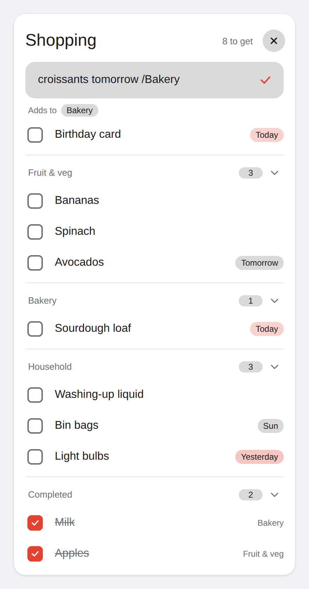

# Todoist Sections Card

[](https://my.home-assistant.io/redirect/hacs_repository/?owner=joshmd&repository=todoist-sections-card&category=plugin)
[](https://hacs.xyz/docs/faq/custom_repositories/)
[](https://github.com/joshmd/todoist-sections-card/actions/workflows/validate.yml)

A Home Assistant dashboard card for Todoist that:

- shows your project's **sections**
- adds items with **Todoist's own natural-language parser** (`milk tomorrow 5pm /Bakery`)
- keeps the add bar tucked away until you need it
- lets you **show or hide completed items and individual sections**



> [!IMPORTANT]
> The card has **two parts**, and you need both:
>
> 1. **The card**, installed by HACS.
> 2. **The bridge package** (`todoist_bridge.yaml`), which you copy into Home Assistant yourself. It talks to Todoist. HACS cannot install it for you.

## Why a separate bridge?

The core Todoist integration exposes each project as a `todo` entity, but Home Assistant's to-do model has no sections. The bridge is a small YAML package of REST sensors and scripts that talk to the Todoist API v1 directly, so sections come through intact.

Your API token stays in `secrets.yaml` on your Home Assistant server. The card runs in your browser and never sees it.

You can keep the core Todoist integration. It still works for voice assistants, which use `todo` entities.

## Requirements

- Home Assistant **2024.8** or newer
- [HACS](https://hacs.xyz), unless you install manually
- A Todoist API token: Todoist → **Settings** → **Integrations** → **Developer** → **Copy API token**

---

## Installation

### Step 1: Install the card with HACS

1. Click this button to open the repository in HACS:

   [](https://my.home-assistant.io/redirect/hacs_repository/?owner=joshmd&repository=todoist-sections-card&category=plugin)

   <details>
   <summary>If the button does not work</summary>

   1. Open **HACS** in Home Assistant.
   2. Select the three-dot menu (top right) → **Custom repositories**.
   3. Repository: `https://github.com/joshmd/todoist-sections-card`
   4. Type: **Dashboard**
   5. Select **Add**, then search HACS for **Todoist Sections Card**.

   </details>

2. Select **Download**, then **Download** again to confirm.
3. When HACS asks, reload your browser.

HACS registers the dashboard resource for you.

<details>
<summary>Install the card manually instead</summary>

1. Download `todoist-sections-card.js` from the [latest release](https://github.com/joshmd/todoist-sections-card/releases/latest).
2. Copy it to `/config/www/todoist-sections-card.js`.
3. Go to **Settings** → **Dashboards** → three-dot menu → **Resources** → **Add resource**:
   - URL: `/local/todoist-sections-card.js?v=0.1.0`
   - Resource type: **JavaScript module**
4. Reload your browser. Change the `?v=` number whenever you update the file, or browsers keep using the old copy.

If you don't see **Resources**, turn on **Advanced mode** in your user profile.

</details>

### Step 2: Install the bridge package

You need to edit files in your `/config` folder. The **File editor** or **Studio Code Server** add-on works, or you can use Samba or SSH.

1. **Turn on packages.** If `configuration.yaml` doesn't already have this, add it:

   ```yaml
   homeassistant:
     packages: !include_dir_named packages
   ```

   If you already have a `homeassistant:` section, add the `packages:` line inside it rather than creating a second one.

2. **Copy the package.** Download [`packages/todoist_bridge.yaml`](packages/todoist_bridge.yaml) and save it as `/config/packages/todoist_bridge.yaml`. Create the `packages` folder if it doesn't exist.

3. **Add your token.** Add this line to `/config/secrets.yaml`, replacing the example with your own token. Keep the word `Bearer ` and the space after it:

   ```yaml
   todoist_auth: "Bearer 0123456789abcdef0123456789abcdef01234567"
   ```

4. **Keep the task list out of the history database.** The sensors hold every task as attributes. Add this to `configuration.yaml`, or merge it into your existing `recorder:` section:

   ```yaml
   recorder:
     exclude:
       entities:
         - sensor.todoist_tasks
         - sensor.todoist_sections
         - sensor.todoist_completed
   ```

5. **Restart.** Go to **Developer tools** → **YAML** → **Check configuration**. If it passes, restart Home Assistant.

6. **Check it works.** In **Developer tools** → **States**, find `sensor.todoist_tasks`. Its state should be a number, and it should have a `results` attribute.

If you never want to show completed items, you can delete the third `rest:` block (`Todoist Completed`) from the package.

### Step 3: Find your project ID

Open the project in the Todoist web app. The ID is the last part of the address, after the final hyphen:

```
https://app.todoist.com/app/project/shopping-6Jf8VQXxpwv59GRH
                                             ^^^^^^^^^^^^^^^^
```

You can also find `project_id` in any entry of the `results` attribute of `sensor.todoist_sections`.

### Step 4: Add the card to a dashboard

Edit a dashboard, select **Add card**, search for **Todoist Sections Card**, then switch to the code editor and set your `project_id`:

```yaml
type: custom:todoist-sections-card
title: Shopping
project_id: 6Jf8VQXxpwv59GRH
count_suffix: to get
show_completed: true
hide_sections:
  - Online
collapsed_sections:
  - Household
add_timeout: 20
```

---

## Privacy and security

Please read this before you install.

- **Your token stays on your server.** It lives in `secrets.yaml` and is only sent to `api.todoist.com`. The card never sees it.
- **Every Home Assistant user can read the task list.** By default the sensors hold tasks from **every project in your Todoist account**, including shared projects. Every Home Assistant user can read them, and so can any app, token or AI assistant with read access to Home Assistant.
- **Every Home Assistant user can change tasks.** Anyone with a Home Assistant login can add, complete and reopen tasks through the bridge.
- **Other Todoist endpoints are blocked.** The bridge only accepts well-formed Todoist IDs and strips anything else from its URLs, so no call can reach another part of the Todoist API. It cannot delete tasks or projects.
- **Don't expose these sensors to voice assistants.** Go to **Settings** → **Voice assistants** → **Expose** and make sure the three `sensor.todoist_*` entities are not exposed to Assist or other voice assistants.

### Optional: only sync one project

To keep other projects out of Home Assistant entirely, add `&project_id=YOUR_PROJECT_ID` to the end of the first two `resource:` URLs in the package:

```yaml
  - resource: https://api.todoist.com/api/v1/tasks?limit=200&project_id=6Jf8VQXxpwv59GRH
  ...
  - resource: https://api.todoist.com/api/v1/sections?limit=200&project_id=6Jf8VQXxpwv59GRH
```

This also raises the 200-task limit to 200 tasks **per project**. In this mode every card must use that same project.

### Optional: limit the scripts to certain projects

Both scripts in the package start with `allowed_projects: []`. List the project IDs your cards use, in both scripts:

```yaml
      - variables:
          allowed_projects: ["6Jf8VQXxpwv59GRH"]
```

The card's scripts then refuse to add to, complete or reopen tasks in any other project. This protects against mistakes and casual misuse. It does not stop a determined Home Assistant user, who can call the underlying `rest_command` actions directly.

---

## Options

| Option | Default | Description |
|---|---|---|
| `project_id` | **required** | Todoist project ID |
| `title` | none | Card heading |
| `show_completed` | `false` | Show a Completed group (needs `sensor.todoist_completed`) |
| `completed_limit` | `10` | Maximum completed items shown |
| `completed_collapsed` | `true` | Completed group starts collapsed |
| `hide_sections` | `[]` | Sections to hide, by name or ID. Their tasks are hidden too |
| `collapsed_sections` | `[]` | Sections collapsed until someone expands them |
| `hide_empty_sections` | `true` | Hide sections with no open tasks |
| `show_unsectioned` | `true` | Show tasks that are not in a section |
| `unsectioned_title` | none | Give unsectioned tasks a header. Without one, they sit at the top |
| `due_display` | `all` | `all`, `soon` (overdue, today, tomorrow) or `none` |
| `add_timeout` | `20` | Seconds of no typing before the add bar closes. `0` = never |
| `show_count` | `true` | Show the open-item count in the header |
| `count_suffix` | `open` | Text after the count, for example `to get` |
| `show_hint` | `true` | Show the syntax hint under the add field |
| `accent` | theme accent | Any CSS colour for the + button, ticks and today chips |
| `tasks_entity` | `sensor.todoist_tasks` | Change this if you renamed the sensors |
| `sections_entity` | `sensor.todoist_sections` | |
| `completed_entity` | `sensor.todoist_completed` | |
| `add_script` | `script.todoist_bridge_add` | |
| `done_script` | `script.todoist_bridge_set_done` | |

Collapsed and expanded sections are remembered per device. Dates follow your Home Assistant language setting.

## Adding items

- **Type naturally:** `milk tomorrow`, `bin bags fri 7pm`, `water filter every 2 months`, `@urgent`, `p1`.
- **Pick a section:** add `/Section` anywhere, for example `bananas /Fruit & veg`. Multi-word section names work. The card shows which section it will use before you save.
- **Unknown sections:** if no section matches, the card warns you and adds the item without a section.
- **Saving:** Enter or the tick saves. The bar stays open for the next item.
- **Closing:** the bar closes after `add_timeout` seconds of no typing and keeps any half-typed text. × or Escape closes it and clears the text.
- **Confirmation:** after saving, the card shows what Todoist actually set, for example "Added milk to Bakery, due tomorrow".

Todoist's parser is eager: `sun cream` becomes an item called "cream" due on Sunday. Rephrase it (`suncream`) or fix the date in Todoist.

## Limits

- Up to 200 active tasks and 200 sections are fetched, across your whole account (or per project in single-project mode). There is no pagination.
- Completed items cover the last 7 days.
- Changes made in the Todoist app appear within 60 seconds. Changes made in the card appear immediately.
- Subtasks are shown flat within their section.

## Troubleshooting

| Symptom | Fix |
|---|---|
| Card says `sensor.todoist_tasks is missing` | The package isn't loaded. Check that `packages:` is in `configuration.yaml`, the file is in `/config/packages/`, and you restarted. |
| `sensor.todoist_tasks` is `unavailable` | Check your token in `secrets.yaml`, including the `Bearer ` prefix. Look in **Settings** → **System** → **Logs** for `rest` errors. |
| "Custom element doesn't exist" | Reload the browser. With a manual install, check the resource URL and type. |
| Items are added but don't land in the right list | Check that `project_id` in the card matches the Todoist address. |

## Licence

[MIT](LICENSE)
